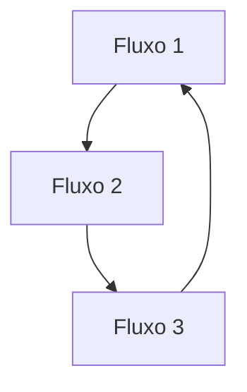
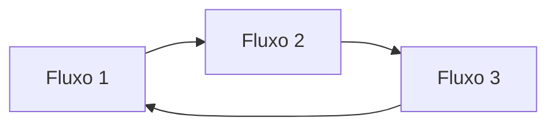
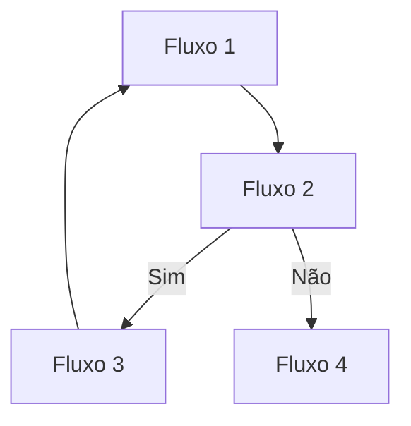

# Fluxo de Processo

## Descrição Detalhada

- Forneça uma explicação detalhada de cada passo do processo automatizado (utilize imagens das telas da automação se julgar necessário).

## Diagrama de Fluxo

- Use diagramas visuais para representar graficamente o fluxo do processo. ou pode ser via PNG, JPG ou via Mermaid

### Exemplos de fluxos com Mermaid

Fluxo horizontal

Fluxo Vertifical

Fluxo Com validação

