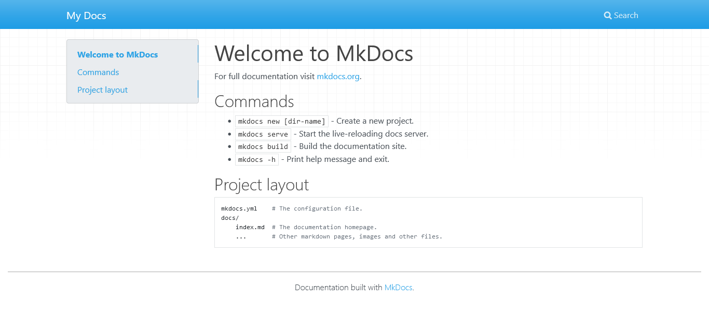
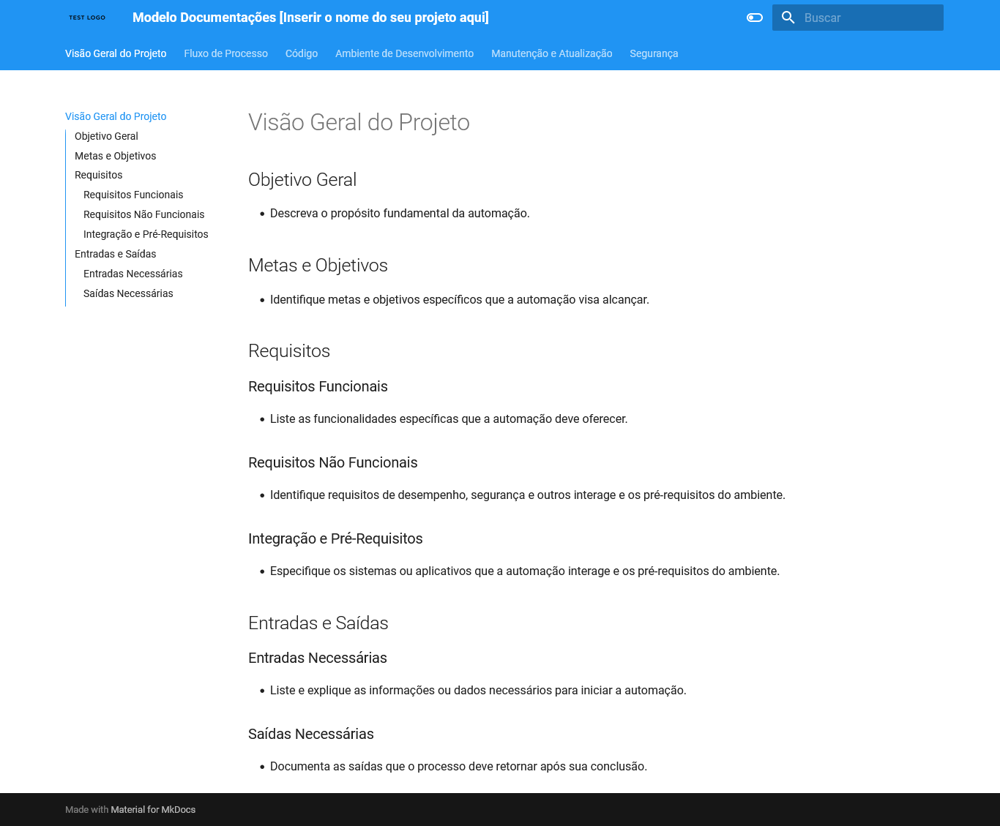

# MkDocs

MkDocs é uma ferramenta para criar documentação estática a partir de arquivos Markdown. É simples, rápido e oferece temas personalizáveis para criar sites de documentação profissionais.

## Por que utilizar MkDocs?

MkDocs é preferível para criar documentação online porque gera sites estáticos a partir de arquivos Markdown, facilitando a hospedagem, manutenção e colaboração.

## Instalando o MKDocs

Para instalar o MkDocs, você pode usar o pip, que é o gerenciador de pacotes do Python. Basta abrir o terminal ou prompt de comando e executar o seguinte comando:

```bash
pip install mkdocs-material
```

Isso instalará o MkDocs e suas dependências necessárias. Certifique-se de ter o Python e o pip instalados em seu sistema antes de executar este comando.

## Utilizando o MKDocs

Após a instalação do MkDocs, você pode criar um novo projeto de documentação ou trabalhar em um existente. Aqui estão os passos básicos para começar:

1. **Crie um novo projeto:** Navegue até o diretório onde deseja criar o projeto da documentação e execute o seguinte comando no terminal ou prompt de comando:

    ```bash
    mkdocs new .
    ```

    Isso criará um novo diretório chamado docs com uma estrutura básica para o seu projeto de documentação.

2. **Inicie o servidor de desenvolvimento:** Execute o seguinte comando para iniciar o servidor de desenvolvimento embutido do MkDocs:

    ```bash
    mkdocs serve
    ```

    Isso iniciará um servidor local e você poderá visualizar sua documentação no navegador visitando <http://localhost:8000>.

## Modelo MKDocs

Há um modelo de documentação pronto para ser utilizado em seu projeto, disponível no diretório `docs-template`.

Para implementá-lo, basta copiar a pasta `docs` e o arquivo `mkdocs.yml` localizados dentro da pasta `docs-template`, substituindo os arquivos correspondentes em seu projeto.

**Observação**: Ao realizar essa substituição, os dados atuais serão sobrescritos. Por precaução, certifique-se de fazer um backup do seu projeto antes de prosseguir.





## Hospedando a Documentação

Quando estiver satisfeito com a documentação, você pode implantá-la em um servidor web. Para fazer isso, você precisa primeiro construir os arquivos estáticos usando o comando:

```bash
mkdocs build
```

Isso criará uma pasta `site` dentro do seu diretório do projeto, contendo todos os arquivos HTML, CSS e JavaScript necessários para o seu site de documentação.

- **Hospede os arquivos estáticos:** Depois de construir os arquivos estáticos, você pode hospeda-los em qualquer serviço de hospedagem web. Basta fazer upload dos arquivos para o seu servidor web ou utilizar serviços de hospedagem como GitHub Pages, Netlify ou AWS S3.
